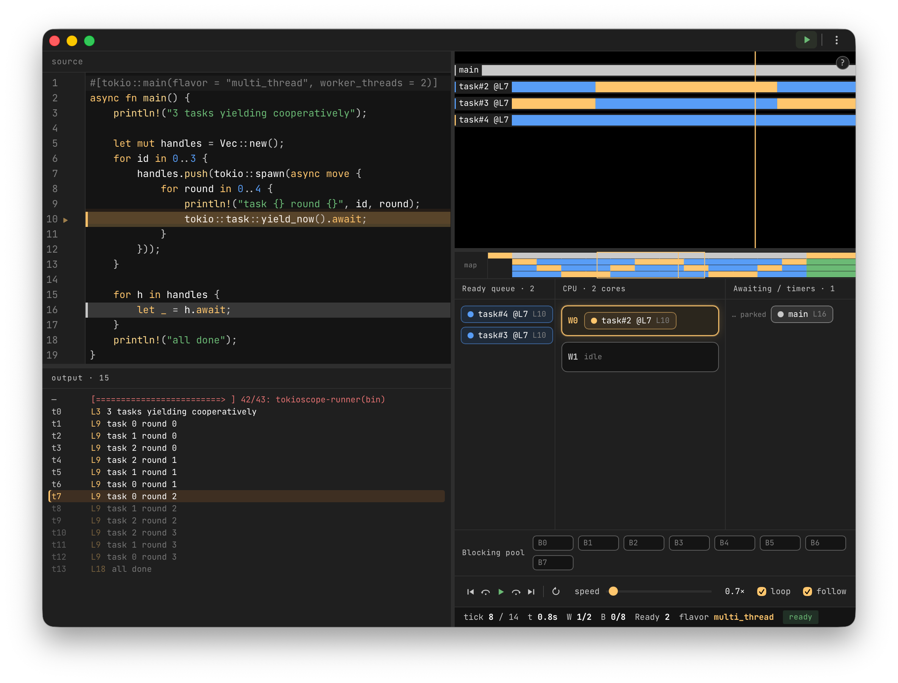

<div align="center">


**See how Tokio schedules your async code — tick by tick.**

A desktop visual debugger that replays the Tokio scheduler frame by frame: tasks, worker cores, the blocking pool, the ready queue, and the exact source line each task is parked on.

[](LICENSE)
[](https://tauri.app)
[](https://svelte.dev)
[](https://www.rust-lang.org)


English · [简体中文](README.zh-CN.md)

</div>

---

## What is TokioScope?

`async` code is hard to reason about precisely because the runtime is invisible. You write `.await` and `tokio::spawn`, but *when* does a task actually run? Which worker picks it up? What blocks it, and what wakes it?

**TokioScope makes the Tokio scheduler visible.** Paste a Rust async snippet, hit Run, and scrub through a deterministic, tick-by-tick replay of how Tokio drives your tasks to completion — with the source line highlighting exactly where each task currently sits.

It's built for **learning, teaching, and debugging** the mental model of cooperative scheduling — not for profiling production workloads.

## Screenshots



> The editor highlights the line each task is parked on; the timeline, scheduler stage, and output log all stay in sync as you scrub.

## Features

- **Deterministic tick replay** — the runtime runs on a paused clock, so every run is reproducible and steppable. Play, pause, step forward/back, and scrub.
- **Coordinated, multi-pane visualization** that stays in sync as you scrub:
  - **Scheduler stage** — worker cores, the blocking pool, and the ready queue, live per tick.
  - **Timeline & minimap** — every task's state across the whole run as a heatmap.
  - **Source highlighting** — the editor highlights each task's current line, colored by state (running / ready / awaiting / blocking), with an "about to run" blink when a task is woken.
  - **Synced output log** — `println!` output streams in step with the playhead; click a line to jump there.
- **Inline diagnostics** — `syn`-based analysis surfaces errors as squiggles before you even run.
- **Rust-aware editor** — CodeMirror 6 with Rust syntax highlighting, autocomplete, and Tokio snippets.
- **Bilingual UI** — English and 简体中文, switchable in-app.
- **Themes** — Darcula-inspired dark, light, and high-contrast.

## How it works

1. Your snippet is parsed with [`syn`](https://docs.rs/syn) and **rewritten** so each scheduling primitive (`spawn`, `await`, `yield_now`, `sleep`, `spawn_blocking`, `println!`, …) is wrapped by a lightweight tracer.
2. The rewritten code runs on a **`current_thread` Tokio runtime with `start_paused(true)`**, advancing time in fixed 100 ms ticks. This makes execution single-threaded and fully deterministic.
3. The tracer emits a JSONL event stream (spawn / poll / yield / await / wake / blocking / println / tick).
4. The frontend aggregates those events into per-tick **frames** and renders them across the timeline, stage, and editor.

> Worker cores are a **visualization** of how a multi-thread runtime *would* spread the work; the underlying replay is deterministic and single-threaded so the timeline is stable and reproducible.

## Requirements

> [!IMPORTANT]
> **TokioScope compiles and runs your snippet locally using your own Rust toolchain.** It is not a sandbox or an interpreter — it shells out to `cargo`. You must have **Rust installed** ([rustup.rs](https://rustup.rs)). On first run, the bundled runner crate is built once (this takes a moment); subsequent runs reuse the cache.

- **Rust toolchain** (`cargo` on your `PATH`) — required at runtime.
- macOS, Windows, or Linux.
- To build from source: [Bun](https://bun.sh) and the [Tauri 2 prerequisites](https://tauri.app/start/prerequisites/).

## Install

### From a release (recommended)

Download the latest installer for your platform from the [Releases page](https://github.com/JohnLyonX/tokioscope/releases):

- **macOS** — `.dmg`
- **Windows** — `.msi`
- **Linux** — `.deb` / `.AppImage`

Then make sure a Rust toolchain is installed (see [Requirements](#requirements)).

> [!NOTE]
> Preview builds are not yet code-signed/notarized. On macOS you may need to right-click → Open the first time; on Windows, dismiss the SmartScreen prompt.

### Build from source

```bash
# 1. Clone
git clone https://github.com/JohnLyonX/tokioscope.git
cd tokioscope

# 2. Install JS dependencies (uses Bun)
bun install

# 3. Run in development
bun run tauri:dev

# 4. Or produce a release bundle
bun run tauri:build
```

## Usage

1. Launch the app and write — or paste — a Tokio async snippet in the editor.
2. Press **Run** (or `⌘/Ctrl + Enter`). Load a built-in example with `⌘/Ctrl + 1/2/3`.
3. Use the playback bar to **play / pause / step**, and scrub the timeline. Watch the scheduler stage and the editor's line highlight move in lockstep.

Built-in examples live in [`examples/`](examples): `current_thread.rs`, `spawn_blocking_join.rs`, `yield_now.rs`.

### Keyboard shortcuts

| Shortcut | Action |
| --- | --- |
| `⌘/Ctrl + Enter` | Run |
| `⌘/Ctrl + .` | Cancel run |
| `⌘/Ctrl + 1/2/3` | Load example 1 / 2 / 3 |
| `⌘/Ctrl + E` | Toggle inline edit |
| `Space` | Play / pause |
| `← / →` | Step back / forward (`Shift` = fine) |
| `Home / End` | Jump to start / end |
| `R` | Restart | 
| `F` | Toggle follow |
| `+ / -` | Zoom timeline |
| `?` | Shortcuts help |

## Roadmap

The biggest planned direction is to **decouple TokioScope from its built-in editor** so you can trace *real programs*, not just snippets pasted into the app:

- **Embeddable tracing crate** — add `tokioscope` as a dev-dependency to your own project, drop in a tracing layer / runtime hook, run your actual binary or tests, and export a trace.
- **Trace file format** — a stable, documented event format (`.tokioscope.jsonl`) that the desktop app can open and replay, so traces can be captured on one machine (or in CI) and inspected on another.
- **No-toolchain replay** — opening a pre-recorded trace should not require a local Rust toolchain; the `cargo` dependency would then only apply to the in-app "edit & run" mode.
- **Richer runtime signals** — real multi-thread interleavings, task budgets, and `tokio-console`-style metrics.

Other near-term items: code signing & notarization, CI builds, and a published trace-format spec.

Have an idea? [Open an issue](https://github.com/JohnLyonX/tokioscope/issues).

## Tech stack

- **Shell:** [Tauri 2](https://tauri.app) (Rust)
- **Backend:** Rust — `syn`/`quote` for rewriting, a paused `tokio` runtime for deterministic replay
- **Frontend:** [Svelte 5](https://svelte.dev) + TypeScript, [CodeMirror 6](https://codemirror.net), Vite
- **Tooling:** [Bun](https://bun.sh)

## Contributing

Issues and PRs are welcome. For larger changes, please open an issue first to discuss the direction. See [`CLAUDE.md`](CLAUDE.md) for the project's coding guidelines.

## License

Licensed under the [Apache License 2.0](LICENSE).
