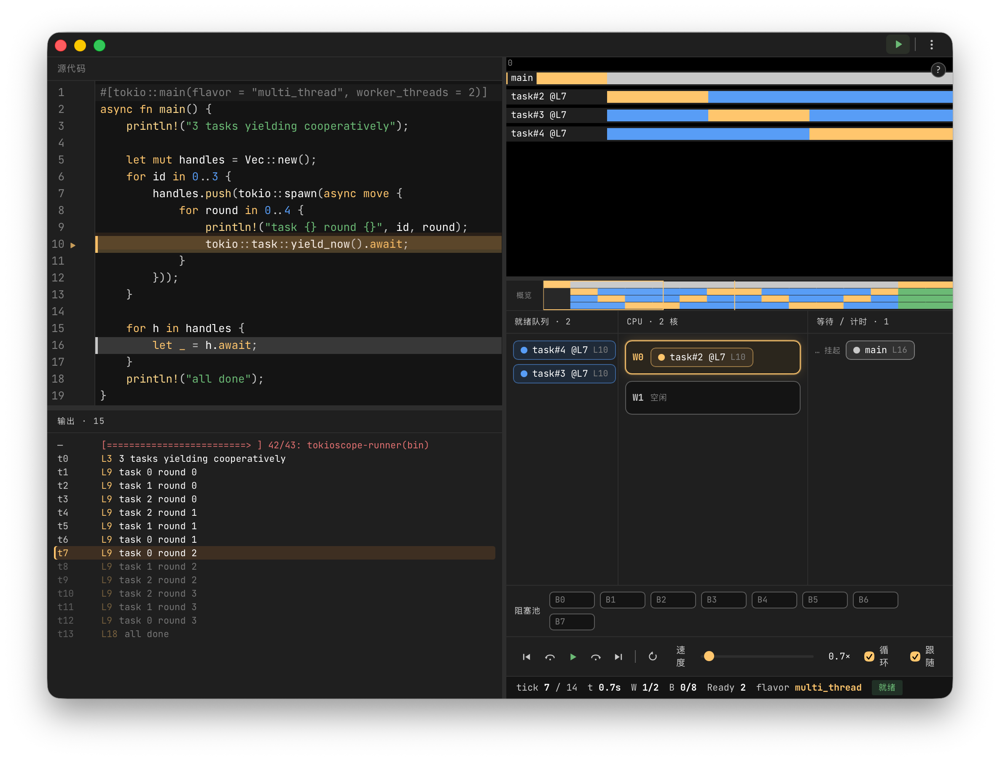

<div align="center">


**逐 tick 观察 Tokio 如何调度你的异步代码。**

一款桌面可视化调试器,把 Tokio 调度器的执行过程一帧一帧地回放出来:任务、worker 核心、阻塞池、就绪队列,以及每个任务当前停留的源码行。

[](LICENSE)
[](https://tauri.app)
[](https://svelte.dev)
[](https://www.rust-lang.org)


[English](README.md) · 简体中文

</div>

---

## TokioScope 是什么?

`async` 代码难以精确推理,正是因为运行时是不可见的。你写下 `.await` 和 `tokio::spawn`,但任务究竟*何时*运行?被哪个 worker 取走?是什么阻塞了它、又是什么唤醒了它?

**TokioScope 让 Tokio 调度器变得可见。** 粘贴一段 Rust 异步代码,点击运行,就能逐 tick 回放 Tokio 是如何驱动你的任务直到完成——并在编辑器里高亮出每个任务此刻所在的源码行。

它面向**学习、教学与调试**协作式调度的心智模型,而非用于分析生产负载。

## 截图



> 编辑器高亮每个任务停留的源码行;拖动进度时,时间线、调度舞台与输出日志保持同步。

## 功能特性

- **确定性 tick 回放** —— 运行时跑在暂停的时钟上,每次运行都可复现、可逐步。支持播放、暂停、前进/后退、拖动进度。
- **多面板协同可视化**,拖动进度时保持同步:
  - **调度舞台** —— worker 核心、阻塞池、就绪队列,逐 tick 实时呈现。
  - **时间线与缩略图** —— 以热力图展示整段运行中每个任务的状态。
  - **源码高亮** —— 编辑器按状态(运行 / 就绪 / 等待 / 阻塞)给每个任务的当前行上色,并在任务被唤醒、即将运行时闪烁提示。
  - **同步输出日志** —— `println!` 输出随播放进度逐步出现;点击某行可跳转到对应时刻。
- **内联诊断** —— 基于 `syn` 的分析在运行前就以波浪线标出错误。
- **Rust 感知编辑器** —— CodeMirror 6,带 Rust 语法高亮、自动补全与 Tokio 片段。
- **双语界面** —— 中文与 English,应用内可切换。
- **多主题** —— Darcula 风深色、浅色、高对比度。

## 工作原理

1. 你的代码片段用 [`syn`](https://docs.rs/syn) 解析并**改写**,使每个调度原语(`spawn`、`await`、`yield_now`、`sleep`、`spawn_blocking`、`println!` 等)都被一层轻量 tracer 包裹。
2. 改写后的代码运行在一个 **`current_thread` 且 `start_paused(true)` 的 Tokio 运行时**上,以固定 100ms 的步长推进时间。这让执行单线程化且完全确定。
3. tracer 输出一条 JSONL 事件流(spawn / poll / yield / await / wake / blocking / println / tick)。
4. 前端把这些事件聚合为逐 tick 的**帧**,并在时间线、舞台与编辑器中渲染出来。

> worker 核心是对多线程运行时*将会*如何分摊工作的一种**可视化**;底层回放是确定且单线程的,以保证时间线稳定、可复现。

## 运行要求

> [!IMPORTANT]
> **TokioScope 使用你本机的 Rust 工具链在本地编译并运行你的代码片段。** 它不是沙箱、也不是解释器——它会调用 `cargo`。因此你必须**已安装 Rust**([rustup.rs](https://rustup.rs))。首次运行时会构建一次内置的 runner crate(需稍等片刻),之后的运行会复用缓存。

- **Rust 工具链**(`cargo` 在 `PATH` 中)—— 运行时必需。
- macOS、Windows 或 Linux。
- 从源码构建还需:[Bun](https://bun.sh) 与 [Tauri 2 环境依赖](https://tauri.app/start/prerequisites/)。

## 安装

### 从 Release 安装(推荐)

在 [Releases 页面](https://github.com/JohnLyonX/tokioscope/releases) 下载对应平台的安装包:

- **macOS** —— `.dmg`
- **Windows** —— `.msi`
- **Linux** —— `.deb` / `.AppImage`

随后确认已安装 Rust 工具链(见 [运行要求](#运行要求))。

> [!NOTE]
> 预览版尚未做代码签名/公证。macOS 首次打开可能需要右键 → 打开;Windows 上请忽略 SmartScreen 提示。

### 从源码构建

```bash
# 1. 克隆
git clone https://github.com/JohnLyonX/tokioscope.git
cd tokioscope

# 2. 安装前端依赖(使用 Bun)
bun install

# 3. 开发模式运行
bun run tauri:dev

# 4. 或打出发布包
bun run tauri:build
```

## 使用

1. 启动应用,在编辑器里编写——或粘贴——一段 Tokio 异步代码。
2. 点击**运行**(或 `⌘/Ctrl + Enter`)。用 `⌘/Ctrl + 1/2/3` 载入内置示例。
3. 用播放栏**播放 / 暂停 / 单步**,并拖动时间线。调度舞台与编辑器行高亮会同步移动。

内置示例位于 [`examples/`](examples):`current_thread.rs`、`spawn_blocking_join.rs`、`yield_now.rs`。

### 键盘快捷键

| 快捷键 | 操作 |
| --- | --- |
| `⌘/Ctrl + Enter` | 运行 |
| `⌘/Ctrl + .` | 取消运行 |
| `⌘/Ctrl + 1/2/3` | 载入示例 1 / 2 / 3 |
| `⌘/Ctrl + E` | 切换内联编辑 |
| `Space` | 播放 / 暂停 |
| `← / →` | 后退 / 前进(`Shift` = 精细) |
| `Home / End` | 跳到开头 / 结尾 |
| `R` | 重新开始 |
| `F` | 切换跟随 |
| `+ / -` | 缩放时间线 |
| `?` | 快捷键帮助 |

## 路线图

最重要的规划方向是**把 TokioScope 与内置编辑器解耦**,让你能够追踪*真实程序*,而不仅仅是粘贴到应用里的代码片段:

- **可嵌入的追踪 crate** —— 把 `tokioscope` 作为 dev-dependency 加入你自己的项目,接入一个 tracing 层 / 运行时钩子,直接运行你真实的二进制或测试,并导出一份 trace。
- **Trace 文件格式** —— 一套稳定、有文档的事件格式(`.tokioscope.jsonl`),桌面应用可以打开并回放;这样 trace 可以在一台机器(或 CI)上采集、在另一台机器上查看。
- **无需工具链的回放** —— 打开一份预先录制的 trace 不应再依赖本机 Rust 工具链;到那时,对 `cargo` 的依赖将只用于应用内的「编辑并运行」模式。
- **更丰富的运行时信号** —— 真实的多线程交错、任务预算,以及 `tokio-console` 式的指标。

近期其他事项:代码签名与公证、CI 构建,以及发布 trace 格式规范。

有想法?欢迎 [提交 issue](https://github.com/JohnLyonX/tokioscope/issues)。

## 技术栈

- **外壳:** [Tauri 2](https://tauri.app)(Rust)
- **后端:** Rust —— 用 `syn`/`quote` 改写代码,用暂停的 `tokio` 运行时做确定性回放
- **前端:** [Svelte 5](https://svelte.dev) + TypeScript、[CodeMirror 6](https://codemirror.net)、Vite
- **工具链:** [Bun](https://bun.sh)

## 贡献

欢迎提交 issue 与 PR。较大的改动请先开 issue 讨论方向。项目编码规范见 [`CLAUDE.md`](CLAUDE.md)。

## 许可证

采用 [Apache License 2.0](LICENSE) 许可。
